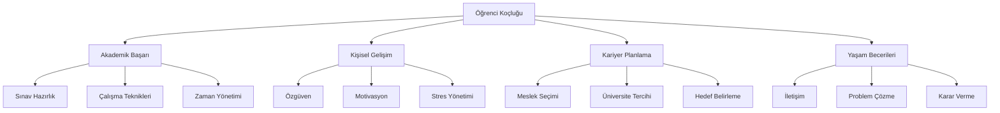
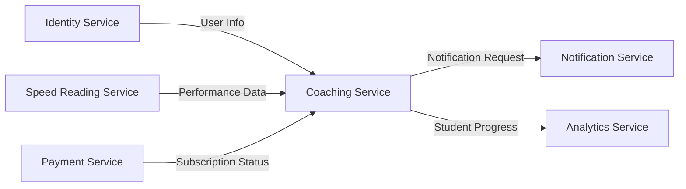

# Öğrenci Koçluk Sistemi: Kapsamlı Araştırma ve Analiz Raporu

**Tarih:** 20 Ocak 2026  
**Hazırlayan:** Antigravity AI  
**Konu:** Dijital Öğrenci Koçluk Sistemi - Akademik Araştırma ve İmplementasyon Önerileri

---

## İÇİNDEKİLER

1. [Yönetici Özeti](#yönetici-özeti)
2. [Öğrenci Koçluğu: Kavramsal Çerçeve](#öğrenci-koçluğu-kavramsal-çerçeve)
3. [Dünya Uygulamaları ve Akademik Bulgular](#dünya-uygulamaları-ve-akademik-bulgular)
4. [Türkiye'deki Durum ve Uygulamalar](#türkiyedeki-durum-ve-uygulamalar)
5. [Dijital Platform Özellikleri ve Teknoloji](#dijital-platform-özellikleri-ve-teknoloji)
6. [Mikroservis Mimarisi İçin Öneriler](#mikroservis-mimarisi-için-öneriler)
7. [Uygulama Yol Haritası](#uygulama-yol-haritası)
8. [Kaynaklar](#kaynaklar)

---

## YÖNETİCİ ÖZETİ

Öğrenci koçluğu, akademik başarıyı artırma, motivasyonu yükseltme ve öğrencilerin kişisel gelişimini destekleme konularında **kanıtlanmış etkilere** sahip yapılandırılmış bir danışmanlık sürecidir.

### Temel Bulgular

#### 📊 Akademik Etki (Kanıtlanmış Sonuçlar)
- **%9** okulda kalma oranı artışı
- **%15** 18 ay sonra okula devam eden öğrenci oranı artışı
- **%4** iki yıllık devam oranı artışı
- **%9** mezuniyet oranı artışı
- GPA (Not Ortalaması) artışları
- Erteleme davranışlarında azalma

#### 🎯 Koçluğun Temel Faydaları
1. **Akademik Performans:** GPA artışı, ders başarısı
2. **Öz-Yeterlilik:** Motivasyon ve özgüven gelişimi
3. **Beceri Geliştirme:** Zaman yönetimi, stres yönetimi, not alma
4. **Hedef Odaklılık:** Somut hedefler belirleme ve takip
5. **Devam ve Mezuniyet:** Okul bırakma oranlarında düşüş

#### 🌍 En İyi Uygulamalar
- **1-1 Kişiselleştirilmiş Oturumlar:** En etkili yöntem
- **Minimum 12 saat / 4 hafta:** Etki için gerekli süre
- **İlişki Temelli Yaklaşım:** Koç-öğrenci güven ilişkisi kritik
- **Bütüncül Destek:** Akademik + Kişisel + Kariyer
- **Veri Odaklı:** İlerleme takibi ve analiz

---

## ÖĞRENCİ KOÇLUĞU: KAVRAMSAL ÇERÇEVE

### Tanım

Öğrenci koçluğu, **yapılandırılmış bir gelişimsel etkileşim süreci** olarak tanımlanır. Bu süreçte:

> "Profesyonel koçlar, öğrencilerin kendilerini tanımalarını, güçlü yanlarını ve yeteneklerini keşfetmelerini, hedef belirlemelerini ve kaynaklarını daha iyi kullanabilmelerini sağlayarak yol haritası ve eylem planı oluşturmalarına destek olurlar."

### Koçluk vs. Diğer Destek Sistemleri

| Özellik | Koçluk | Danışmanlık | Rehberlik | Psikolojik Danışma |
|---------|--------|-------------|-----------|-------------------|
| **Odak** | Gelecek, Hedefler | Problem Çözme | Bilgi Verme | Geçmiş, Travma |
| **Süre** | Orta-Uzun Vade | Kısa-Orta | Tek Seferlik | Uzun Vade |
| **Yaklaşım** | Yapılandırılmış | Esnek | Bilgilendirme | Terapötik |
| **Sonuç** | Eylem Planı | Çözüm | Yönlendirme | İyileşme |

### Koçluğun Kapsamı



---

## DÜNYA UYGULAMALARI VE AKADEMİK BULGULAR

### Kanıtlanmış Sonuçlar

#### 1. Akademik Performans ve Başarı

**MIT Abdul Latif Jameel Poverty Action Lab (J-PAL) Araştırması:**
- Coached öğrenciler **%9 daha fazla** okula devam etti
- İki yıl sonra **%4 daha fazla** kayıtlı kaldı
- 18 ay sonra **%15** daha yüksek devam oranı

**US Department of Education Çalışması:**
- Academic recovery programlarında **GPA artışı**
- Akademik başarısızlık oranlarında düşüş

#### 2. Etkili Koçluk Modelleri

##### GROW Modeli (En Yaygın Kullanılan)

```
G - Goal (Hedef)
│  └─ Ne başarmak istiyorsun?
│  └─ Başarı nasıl ölçülecek?
│
R - Reality (Gerçeklik)
│  └─ Şu anki durumun nedir?
│  └─ Karşılaştığın engeller neler?
│
O - Options (Seçenekler)
│  └─ Ne yapabilirsin?
│  └─ Hangi stratejiler işe yarar?
│
W - Way Forward (İleri Adım)
    └─ Hangi aksiyonu alacaksın?
    └─ Ne zaman başlayacaksın?
```

**Diğer Modeller:**
- **OSKAR:** Outcome, Scaling, Know-how, Affirm+Action, Review
- **CLEAR:** Contracting, Listening, Exploring, Action, Review
- **TGROW:** Topic + GROW
- **Yaşam Çarkı (Life Wheel):** 8 alan dengesi

#### 3. Başarı Faktörleri

**✅ Yapılması Gerekenler:**

1. **Kişiselleştirilmiş Destek**
   - 1-1 oturumlar en etkili
   - Grup koçluğu ikincil destek olarak kullanılabilir

2. **Yeterli Temas Saati**
   - Minimum: 12 saat / 4 hafta
   - Optimal: Haftalık düzenli görüşmeler

3. **İlişki Odaklı Yaklaşım**
   - Empati ve güven temelinde
   - Yargılayıcı olmayan tutum
   - Tutarlı koç ataması (aynı koç devam etmeli)

4. **Yapılandırılmış Süreç**
   - Reflektif sorular
   - Formal öz değerlendirme
   - Somut eylem planları
   - Düzenli takip

5. **Bütüncül Yaklaşım**
   - Akademik + Kişisel + Kariyer + Finansal + Sağlık

**❌ Kaçınılması Gerekenler:**

- Koç değişiklikleri (tutarsızlık)
- Yeterli süre/seans olmadan beklenti
- Sadece problem odaklı yaklaşım
- Veri takibi olmadan çalışmak
- Kurumsal desteğin olmaması

### Uluslararası Platformlar ve Teknolojiler

#### Lider Platformlar:

| Platform | Özellikler | Hedef Kitle |
|----------|-----------|-------------|
| **Lattice Grow** | GROW modeli entegrasyonu, 1-1 tracking, goal management | Üniversite, Kurumsal |
| **PerformYard** | Performance reviews, continuous feedback, SMART goals | Kurumsal, Yükseköğretim |
| **BuddiesHR** | Real-time analytics, engagement tracking, behavior monitoring | Kurumsal |
| **UExcelerate** | AI-powered personalization, learning path customization | Yükseköğretim |
| **Pearson Coaching** | AI study tools, progress analytics, adaptive learning | K-12, Yükseköğretim |

---

## TÜRKİYE'DEKİ DURUM VE UYGULAMALAR

### Akademik Çalışmalar

#### Ana Bulgular (Türkiye Araştırmaları)

1. **Eğitim Koçluğu İlgisi Artıyor:**
   - Özellikle TEOG, LGS, YKS ve dil sınavlarında
   - 2017'den itibaren akademik çalışmalar artışta
   - Henüz ortaokul düzeyinde yeterli çalışma yok

2. **Kanıtlanmış Etkiler (Türkiye):**
   - Yılsonu başarı puanlarında **anlamlı artış**
   - Sınav kaygısında azalma
   - Sistemli çalışma alışkanlığı kazanma
   - Ezberden aktif öğrenmeye geçiş

3. **Koçluğun Algılanışı:**
   - "Yol Arkadaşlığı" teması
   - "Farkındalık Oluşturma" odağı
   - Hedef ve vizyon odaklı çalışma

### Türkiye'deki Dijital Platformlar

#### Öne Çıkan Çözümler:

| Platform | Özellikler | Hedef Kitle | Öne Çıkan Özellik |
|----------|-----------|-------------|-------------------|
| **Cloud Akademi** | Yetenek analizi, öğrenme stili, çoklu zeka, hız okuma yazılımı | K-12 | Kapsamlı analiz + Hız okuma entegrasyonu |
| **SınavKoçu** | Öğrenci takip paneli, gelişim izleme, görev yönetimi, deneme analizi | LGS/YKS | Tek panel yönetim |
| **360° Koçluk** | 80 farklı alanda envanter, yerli sistem | Tüm seviyeler | Detaylı analiz (80 alan) |
| **K12 Koçluk Yazılımı** | Online akademi, ödev yönetimi, sınav yönetimi, kişisel gelişim | K-12 Kurumsal | Modüler yapı |
| **EduMy** | Yapay zeka destekli, hibrit model, kurumsal koçluk | K-12 | AI destekli |
| **Kopilot** | YKS/LGS özel, derece yapmış koçlar, 1-1 koçluk | LGS/YKS | Uzman koç kadrosu |
| **Kunduz** | 7/24 soru çözümü, haftalık koçluk, canlı dersler | LGS/YKS | 7/24 destek |
| **Adek Koçluk** | Online platform, geniş koç ağı | Tüm seviyeler | Topluluk odaklı |

### Türkiye için Fırsatlar

1. **Eksik Alanlar:**
   - Matematik, Fen, Türkçe derslerine özel ortaokul koçluğu
   - Üniversite düzeyinde yaygın koçluk sistemleri
   - Standart ölçüm araçları

2. **Güçlü Taraflar:**
   - Yerli yazılımlar gelişiyor
   - Sınav odaklı yaklaşım güçlü (LGS, YKS)
   - Veli katılımı yüksek
   - Dijitalleşmeye yatkınlık

3. **Gelişim Alanları:**
   - Uluslararası standartlarda araştırmalar
   - Koç eğitimi ve sertifikasyonu
   - Holistik yaklaşım (sadece sınav değil)

---

## DİJİTAL PLATFORM ÖZELLİKLERİ VE TEKNOLOJİ

### Core Özellikler (Must-Have)

#### 1. Koçluk Yönetimi

```yaml
Features:
  - 1-1 Seans Planlama ve Takvim
  - Video Konferans Entegrasyonu (Zoom, Teams, Meet)
  - Seans Kayıt ve Playback
  - Notlar ve Takip Sistemi
  - Koç-Öğrenci Messaging (Secure)
```

#### 2. Öğrenci Profili ve Değerlendirme

```yaml
Features:
  - Kapsamlı Öğrenci Profili:
      - Kişisel Bilgiler
      - Akademik Geçmiş
      - Öğrenme Stili (VARK, Kolb vb.)
      - Çoklu Zeka Analizi
      - Kişilik Değerlendirmesi (MBTI, Big Five)
      - Güçlü/Zayıf Yönler
  - İlerleme Takibi:
      - Hedef Belirleme (SMART)
      - Haftalık/Aylık İlerleme
      - Başarı Metrikleri
      - Sınav Sonuçları
```

#### 3. İçerik ve Kaynak Yönetimi

```yaml
Features:
  - Koçluk Materyalleri Kütüphanesi
  - Çalışma Planları Şablonları
  - Kaynak Paylaşımı (PDF, Video, Link)
  - Ödev ve Görev Atama
  - Seviye Bazlı İçerik
```

#### 4. İletişim ve İşbirliği

```yaml
Channels:
  - Koç-Öğrenci Messaging
  - Koç-Veli iletişimi
  - Grup Tartışma Odaları
  - Bildirimler (Email, SMS, Push)
  - Video Call
  - Screen Sharing
  - Interaktif Whiteboard
```

#### 5. Analitik ve Raporlama

```yaml
Analytics:
  - Öğrenci Dashboard:
      - İlerleme Grafiği
      - Tamamlanan Hedefler
      - Güçlü/Zayıf Alanlar
      - Seans Geçmişi
  - Koç Dashboard:
      - Öğrenci Listesi ve Durumları
      - Toplam Seans Sayısı
      - Başarı Metrikleri
      - Aksiyon Gerektirenler
  - Veli Dashboard:
      - Çocuğun İlerlemesi
      - Koç Notları
      - Sınav Sonuçları
  - Admin Dashboard:
      - Sistem Genel İstatistikleri
      - Koç Performansı
      - Öğrenci Başarı Oranları
```

#### 6. AI Destekli Özellikler (Nice-to-Have)

```yaml
AI_Features:
  - Otomatik Çalışma Planı Önerisi
  - Kişiselleştirilmiş Öğrenme Yolları
  - Riskte Öğrenci Tespiti (Early Warning)
  - Soru-Cevap Chatbot (24/7 Destek)
  - Akıllı Kaynak Önerisi
  - Performans Tahmin Modelleri
```

### Teknik Mimari Önerileri

#### Mikroservis Yapısı

```
eduplatform/
├── services/
│   ├── identity-service/          (Mevcut)
│   ├── notification-service/      (Mevcut)
│   ├── speed-reading-service/     (Mevcut - Varsa)
│   └── coaching-service/          (YENİ)
│       ├── Coaching.API/
│       ├── Coaching.Application/
│       ├── Coaching.Domain/
│       └── Coaching.Infrastructure/
```

#### Domain Entities (Coaching Service)

```csharp
// Core Entities
- CoachProfile
- StudentProfile
- CoachingSession
- GoalSetting
- ProgressTracking
- ActionPlan
- Assessment
- Resource
- Message
- Notification

// Supporting Entities
- LearningStyle
- PersonalityType
- SkillEvaluation
- AcademicHistory
```

---

## MİKROSERVİS MİMARİSİ İÇİN ÖNERİLER

### 1. Coaching Service Domain Model

```csharp
namespace Coaching.Domain.Entities;

// Koç Profili
public class CoachProfile
{
    public Guid Id { get; set; }
    public Guid UserId { get; set; } // Identity Service'ten
    public string Specialization { get; set; } // LGS, YKS, Kariyer vb.
    public List<string> Certifications { get; set; }
    public int YearsOfExperience { get; set; }
    public decimal Rating { get; set; }
    public int TotalSessions { get; set; }
    public List<StudentCoaching> Students { get; set; }
}

// Öğrenci Koçluk İlişkisi
public class StudentCoaching
{
    public Guid Id { get; set; }
    public Guid StudentId { get; set; }
    public Guid CoachId { get; set; }
    public DateTime StartDate { get; set; }
    public DateTime? EndDate { get; set; }
    public CoachingStatus Status { get; set; }
    public List<CoachingSession> Sessions { get; set; }
    public List<Goal> Goals { get; set; }
}

// Koçluk Seansı
public class CoachingSession
{
    public Guid Id { get; set; }
    public Guid StudentCoachingId { get; set; }
    public DateTime ScheduledDate { get; set; }
    public int DurationMinutes { get; set; }
    public SessionType Type { get; set; } // Initial, Regular, Review, Emergency
    public SessionStatus Status { get; set; } // Scheduled, Completed, Cancelled
    public string CoachNotes { get; set; }
    public string StudentFeedback { get; set; }
    public List<ActionItem> ActionItems { get; set; }
    public string RecordingUrl { get; set; }
}

// Hedef Belirleme (SMART Goals)
public class Goal
{
    public Guid Id { get; set; }
    public Guid StudentCoachingId { get; set; }
    public string Title { get; set; }
    public string Description { get; set; }
    public GoalCategory Category { get; set; } // Academic, Personal, Career
    public DateTime TargetDate { get; set; }
    public bool IsCompleted { get; set; }
    public int ProgressPercentage { get; set; }
    public List<Milestone> Milestones { get; set; }
}

// Eylem Planı
public class ActionItem
{
    public Guid Id { get; set; }
    public Guid SessionId { get; set; }
    public string Description { get; set; }
    public DateTime DueDate { get; set; }
    public Priority Priority { get; set; }
    public bool IsCompleted { get; set; }
}

// Değerlendirme
public class Assessment
{
    public Guid Id { get; set; }
    public Guid StudentId { get; set; }
    public AssessmentType Type { get; set; } // LearningStyle, Personality, Skills
    public DateTime CompletedDate { get; set; }
    public Dictionary<string, object> Results { get; set; }
}
```

### 2. API Endpoints Tasarımı

```
# Koç Yönetimi
GET     /api/coaches                    # Koç listesi (filtreleme ile)
GET     /api/coaches/{id}               # Koç detayı
POST    /api/coaches                    # Koç profili oluştur
PUT     /api/coaches/{id}               # Koç profili güncelle

# Öğrenci-Koç Eşleştirme
POST    /api/coaching/assign            # Öğrenciye koç ata
GET     /api/coaching/my-students       # Koçun öğrencileri
GET     /api/coaching/my-coach          # Öğrencinin koçu

# Seans Yönetimi
POST    /api/sessions                   # Seans planla
GET     /api/sessions/{id}              # Seans detayı
PUTCH   /api/sessions/{id}              # Seans güncelle (tamamla, iptal)
GET     /api/sessions/upcoming          # Yaklaşan seanslar
POST    /api/sessions/{id}/notes        # Seans notları ekle

# Hedef Yönetimi
POST    /api/goals                      # Hedef oluştur
GET     /api/goals                      # Hedefler listesi
PUT     /api/goals/{id}                 # Hedef güncelle
PUT     /api/goals/{id}/progress        # İlerleme güncelle

# Değerlendirme
POST    /api/assessments                # Değerlendirme yap
GET     /api/assessments/{studentId}    # Öğrenci değerlendirmeleri

# İletişim
POST    /api/messages                   # Mesaj gönder
GET     /api/messages/conversations     # Konuşmalar
GET     /api/messages/{conversationId}  # Mesaj detayları

# Raporlama
GET     /api/reports/student/{id}       # Öğrenci raporu
GET     /api/reports/coach/{id}         # Koç raporu
GET     /api/reports/progress           # İlerleme raporu
```

### 3. Event-Driven Architecture

```yaml
Events to Publish:
  - CoachAssignedEvent
  - SessionScheduledEvent
  - SessionCompletedEvent
  - GoalCreatedEvent
  - GoalCompletedEvent
  - ProgressUpdatedEvent
  - MessageSentEvent
  - AssessmentCompletedEvent

Events to Consume:
  - UserCreatedEvent (Identity Service)
  - TeacherProfileCreatedEvent
  - StudentProfileCreatedEvent
  - PaymentCompletedEvent (eğer ücretli ise)
```

### 4. Database Schema

```sql
-- Coaches Table
CREATE TABLE Coaches (
    Id UUID PRIMARY KEY,
    UserId UUID NOT NULL, -- FK to Identity Service
    Specialization VARCHAR(100),
    YearsOfExperience INT,
    Rating DECIMAL(3,2),
    TotalSessions INT,
    CreatedAt TIMESTAMP,
    UpdatedAt TIMESTAMP
);

-- Student Coaching Relationships
CREATE TABLE StudentCoachings (
    Id UUID PRIMARY KEY,
    StudentId UUID NOT NULL,
    CoachId UUID NOT NULL,
    StartDate DATE,
    EndDate DATE,
    Status VARCHAR(20),
    CreatedAt TIMESTAMP
);

-- Sessions
CREATE TABLE CoachingSessions (
    Id UUID PRIMARY KEY,
    StudentCoachingId UUID REFERENCES StudentCoachings(Id),
    ScheduledDate TIMESTAMP,
    DurationMinutes INT,
    Type VARCHAR(20),
    Status VARCHAR(20),
    CoachNotes TEXT,
    StudentFeedback TEXT,
    RecordingUrl VARCHAR(500),
    CreatedAt TIMESTAMP
);

-- Goals
CREATE TABLE Goals (
    Id UUID PRIMARY KEY,
    StudentCoachingId UUID REFERENCES StudentCoachings(Id),
    Title VARCHAR(200),
    Description TEXT,
    Category VARCHAR(50),
    TargetDate DATE,
    IsCompleted BOOLEAN,
    ProgressPercentage INT,
    CreatedAt TIMESTAMP
);

-- Assessments
CREATE TABLE Assessments (
    Id UUID PRIMARY KEY,
    StudentId UUID NOT NULL,
    Type VARCHAR(50),
    CompletedDate TIMESTAMP,
    ResultsJson JSONB,
    CreatedAt TIMESTAMP
);

-- Messages
CREATE TABLE Messages (
    Id UUID PRIMARY KEY,
    SenderId UUID NOT NULL,
    ReceiverId UUID NOT NULL,
    ConversationId UUID NOT NULL,
    Content TEXT,
    IsRead BOOLEAN DEFAULT FALSE,
    CreatedAt TIMESTAMP
);
```

### 5. Diğer Servislerle Entegrasyon



**Entegrasyon Noktaları:**

1. **Identity Service:**
   - Kullanıcı doğrulama
   - Rol kontrolü (Coach, Student, Parent)
   - Profil bilgileri

2. **Notification Service:**
   - Seans hatırlatmaları
   - Hedef tamamlama bildirimleri
   - Mesaj bildirimleri

3. **Speed Reading Service (varsa):**
   - Öğrenci performans verileri
   - Hız okuma ilerlemesi
   - Koçluk için veri kaynağı

4. **Analytics Service (gelecek):**
   - Koçluk etkinliği analizi
   - Başarı metrikleri
   - Tahminsel analiz

---

## UYGULAMA YOL HARİTASI

### Minimum Viable Product (MVP) - 2 Ay

#### Faz 1: Temel Altyapı (2 Hafta)

**Hafta 1-2:**
- [ ] Coaching Service mikroservis yapısı kurulumu
- [ ] Domain modelleri ve entity'ler
- [ ] PostgreSQL veritabanı şeması
- [ ] Identity Service entegrasyonu
- [ ] Temel API endpoints

**Çıktılar:**
- `Coaching.Domain` - Entity ve Aggregateler
- `Coaching.Infrastructure` - DbContext, Repositories
- `Coaching.Application` - CQRS handlers
- `Coaching.API` - REST endpoints

#### Faz 2: Core Features (3 Hafta)

**Hafta 3-4: Koç-Öğrenci Yönetimi**
- [ ] Koç profili oluşturma
- [ ] Öğrenci-koç eşleştirme
- [ ] Koç arama ve filtreleme
- [ ] Profil yönetimi

**Hafta 5: Seans Yönetimi**
- [ ] Seans planlama
- [ ] Takvim entegrasyonu
- [ ] Seans notları
- [ ] Video conference entegrasyonu (Zoom/Teams)

**Çıktılar:**
- Koç profilleri
- Öğrenci-koç eşleşmeleri
- Seans planlama sistemi

#### Faz 3: Koçluk Araçları (3 Hafta)

**Hafta 6-7: Hedef ve İlerleme Takibi**
- [ ] SMART hedef oluşturma
- [ ] Milestone tanımlama
- [ ] İlerleme güncelleme
- [ ] Görselleşt irme (grafik, dashboard)

**Hafta 8: İletişim ve Bildirimler**
- [ ] Koç-öğrenci messaging
- [ ] Email bildirimleri (Notification Service)
- [ ] In-app bildirimler
- [ ] Seans hatırlatmaları

**Çıktılar:**
- Hedef yönetim sistemi
- İletişim altyapısı
- Bildirim sistemi entegrasyonu

### Version 1.0 (3-4 Ay)

#### Faz 4: Değerlendirme ve Raporlama (2 Hafta)

**Özellikler:**
- [ ] Öğrenme stili değerlendirmesi (VARK)
- [ ] Kişilik değerlendirmesi (basit)
- [ ] Beceri analizi
- [ ] Öğrenci ilerleme raporu
- [ ] Koç performans raporu
- [ ] Veli raporu

#### Faz 5: İçerik Yönetimi (2 Hafta)

**Özellikler:**
- [ ] Kaynak kütüphanesi
- [ ] Çalışma planı şablonları
- [ ] Koçluk materyalleri
- [ ] Ödev/görev sistemi
- [ ] Dosya paylaşımı

#### Faz 6: Analytics ve Insights (2 Hafta)

**Özellikler:**
- [ ] Dashboard'lar (Coach, Student, Parent, Admin)
- [ ] İstatistiksel analizler
- [ ] Başarı metrikleri
- [ ] Trend analizleri
- [ ] Export/PDF raporlar

### Version 2.0 (6+ Ay)

#### Gelişmiş Özellikler

**AI ve Machine Learning:**
- Otomatik risk tespiti
- Kişiselleştirilmiş öneri sistemi
- Chatbot asistan (7/24)
- Tahminsel analitik

**Genişletilmiş Özellikler:**
- Grup koçluğu seansları
- Webinar/canlı ders entegrasyonu
- Gamification (rozet, puan)
- Sosyal öğrenme (forum, topluluk)
- Mobil uygulama

**Entegrasyonlar:**
- LMS (Learning Management System) entegrasyonu
- Sınav sistemleri entegrasyonu
- Video conference platformları
- Ödeme sistemleri (ücretli koçluksa)

---

## TEKNİK STACK ÖNERİLERİ

### Backend

```yaml
Core:
  - .NET 9.0
  - ASP.NET Core Web API
  - Entity Framework Core 9.0
  
Database:
  - PostgreSQL (Ana veritabanı)
  - Redis (Cache, SignalR backplane)
  
Messaging:
  - RabbitMQ + MassTransit
  
Authentication:
  - Keycloak OAuth2/OIDC
  
Real-time:
  - SignalR (WebSocket)
  
Search:
  - Elasticsearch (gelecek için, koç arama)
  
File Storage:
  - MinIO / AWS S3 (kaynak dosyaları)
  
Video Conference:
  - Zoom SDK / Microsoft Teams
  - Jitsi (open-source alternatif)
```

### Frontend (Öneriler)

```yaml
Web:
  - Next.js 14+ (React)
  - TailwindCSS
  - Shadcn UI
  - Recharts (grafikler için)
  - FullCalendar (takvim)
  
Mobile:
  - Flutter (cross-platform)
  - React Native (alternatif)
  
State Management:
  - Zustand / Redux Toolkit
  
API Client:
  - Axios / TanStack Query
```

---

## GÜVENLİK VE UYUMLULUK

### KVKK (Kişisel Verilerin Korunması)

**Hassas Veriler:**
- Öğrenci kişisel bilgileri
- Seans kayıtları (ses/video)
- Değerlendirme sonuçları
- İletişim kayıtları

**Gerekli Önlemler:**
- [ ] Açık rıza (explicit consent)
- [ ] Veri minimizasyonu
- [ ] Şifreleme (at-rest, in-transit)
- [ ] Erişim kontrolü (RBAC)
- [ ] Audit logging
- [ ] Veri saklama politikası
- [ ] Veri silme/anonimleştirme

### Güvenlik Katmanları

```yaml
1. Authentication & Authorization:
   - Keycloak JWT
   - Role-based access (Coach, Student, Parent, Admin)
   - Multi-factor authentication (optional)

2. Data Protection:
   - TLS/SSL (HTTPS)
   - Database encryption
   - Sensitive field encryption (ayrıca)
   - Secure file storage

3. API Security:
   - Rate limiting
   - Request validation
   - SQL injection prevention (EF Core parametrized)
   - XSS protection
   - CORS policy

4. Monitoring & Auditing:
   - Serilog + Seq
   - User activity logs
   - Security event alerts
   - GDPR compliance logs
```

---

## BAŞARI KRİTERLERİ VE METRIKLER

### KPI'lar (Key Performance Indicators)

#### Öğrenci Başarı Metrikleri

```yaml
Academic:
  - GPA artışı (%)
  - Sınav başarı oranı artışı
  - Hedef tamamlama oranı (%)
  - Ders devam oranı artışı
  
Engagement:
  - Seans katılım oranı (%)
  - Seans başına ortalama süre
  - Görev tamamlama oranı (%)
  - Platform kullanım sıklığı
  
Satisfaction:
  - Öğrenci memnuniyet skoru (NPS)
  - Koç memnuniyet skoru
  - Veli memnuniyet skoru
```

#### Koç Performans Metrikleri

```yaml
Efficiency:
  - Aktif öğrenci sayısı
  - Tamamlanan seans sayısı
  - Ortalama seans süresi
  - Yanıt süresi (mesajlara)
  
Impact:
  - Öğrenci başarı artış oranı
  - Hedef tamamlama oranı
  - Öğrenci tutma oranı (retention)
  
Quality:
  - Öğrenci rating/feedback
  - Seans kalite skoru
  - Eylem planı tamamlama oranı
```

#### Sistem Metrikleri

```yaml
Performance:
  - API response time (< 200ms)
  - Uptime (> 99.5%)
  - Concurrent users support
  
Usage:
  - Daily Active Users (DAU)
  - Monthly Active Users (MAU)
  - Session booking rate
  - Message volume
```

### Benchmark Hedefler (İlk Yıl)

```yaml
Q1 (İlk 3 Ay):
  - 10 aktif koç
  - 50 aktif öğrenci
  - 200+ tamamlanan seans
  - %80+ seans katılım oranı
  
Q2 (3-6 Ay):
  - 25 aktif koç
  - 150 aktif öğrenci
  - 800+ tamamlanan seans
  - %85+ seans katılım oranı
  - İlk başarı hikayeleri
  
Q3-Q4 (6-12 Ay):
  - 50+ aktif koç
  - 500+ aktif öğrenci
  - 3000+ tamamlanan seans
  - %90+ seans katılım oranı
  - Ölçülebilir akademik iyileşme
```

---

## MALİYET TAHMİNİ (Yıllık, SaaS Model)

### Geliştirme Maliyetleri

```yaml
Development Team (6 ay MVP):
  - Backend Developer (2x): ₺600,000
  - Frontend Developer (2x): ₺500,000
  - UI/UX Designer (1x): ₺200,000
  - QA Engineer (1x): ₺180,000
  - DevOps (part-time): ₺100,000
  - Product Manager (part-time): ₺150,000
  Total: ₺1,730,000
  
Infrastructure (Annual):
  - Cloud Hosting (AWS/Azure): ₺120,000
  - Database (managed): ₺60,000
  - CDN + Storage: ₺40,000
  - Video Conference API: ₺80,000
  - Monitoring Tools: ₺30,000
  - Email/SMS: ₺20,000
  Total: ₺350,000
  
Licenses:
  - Development Tools: ₺50,000
  - Third-party APIs: ₺100,000
  Total: ₺150,000
  
GRAND TOTAL (First Year): ₺2,230,000
```

### İşletme Maliyetleri (Yıl 2+)

```yaml
Annual Operating Costs:
  - Maintenance & Updates: ₺400,000
  - Infrastructure: ₺350,000
  - Support Team (3x): ₺450,000
  - Marketing: ₺300,000
  - Coach Recruitment: ₺200,000
  Total: ₺1,700,000/yıl
```

---

## RİSKLER VE AZALTMA STRATEJİLERİ

### Ana Riskler

| Risk | Olasılık | Etki | Azaltma Stratejisi |
|------|----------|------|-------------------|
| **Koç Kalitesi** | Orta | Yüksek | Sert seçim süreci, sürekli eğitim, performans izleme |
| **Öğrenci Bağlılığı** | Yüksek | Yüksek | Gamification, hatırlatmalar, veli katılımı |
| **Teknik Sorunlar** | Orta | Orta | Yedekli altyapı, monitoring, otomatik scaling |
| **Rekabet** | Yüksek | Orta | Farklılaşma (AI, hız okuma entegrasyonu), üstün UX |
| **Regulasyon (KV KK)** | Orta | Yüksek | Legal danışmanlık, compliance-first design |
| **Ölçekleme** | Orta | Orta | Mikroservis mimarisi, caching, CDN kullanımı |

---

## SONUÇ VE ÖNERİLER

### Önerilen Strateji

1. **MVP ile Başla** (2 ay)
   - Temel koçluk özellikleri
   - Küçük pilot grup (10 koç, 50 öğrenci)
   - Hızlı feedback döngüsü

2. **İteratif Geliştir**
   - Kullanıcı geri bildirimlerine göre pivot
   - Her 2 haftada bir release
   - Sürekli iyileştirme

3. **Farklılaş**
   - Hız okuma sistemi ile entegrasyon
   - AI destekli kişiselleştirme
   - Kapsamlı analitik
   - Mobil-first yaklaşım

4. **Kaliteye Odaklan**
   - Koç seçiminde titiz olun
   - Sürekli eğitim programları
   - Öğrenci memnuniyeti KPI'ı

5. **Veri Odaklı Karar**
   - A/B testing
   - Analitik takibi
   - Başarı metriklerini izle

### Hemen Yapılabilecekler

**✅ Kısa Vadeli (1-2 Hafta):**
- [ ] Detaylı proje planı oluştur
- [ ] Domain model netleştir
- [ ] Mikroservis iskeletini kur
- [ ] Database şemasını tasarla
- [ ] API endpoint'lerini belirle

**🎯 Orta Vadeli (1 Ay):**
- [ ] MVP özellikleri kod
- [ ] Koç onboarding sürecini tasarla
- [ ] Pilot koç grubu belirle
- [ ] Beta test planı hazırla

**🚀 Uzun Vadeli (3-6 Ay):**
- [ ] Full MVP teslim
- [ ] Pilot program başlat
- [ ] Feedback topla ve iterasyon
- [ ] V1.0'a doğru geliştir

---

## KAYNAKLAR

### Akademik Makaleler

1. MIT J-PAL - "Coaching for Better Outcomes" (2020)
2. U.S. Department of Education - "Academic Coaching Impact Study" (2019)
3. Taylor & Francis - "Academic Coaching in Higher Education" (2021)
4. ResearchGate - "Student Coaching Systems Effectiveness" (2022)

### Türkiye Araştırmaları

1. DergiPark - "Eğitim Koçluğunun Akademik Başarıya Etkisi" (2020)
2. İstanbul Üniversitesi - "Öğrenci Koçluğu Algısı" (2021)
3. DergiPark - "Koçluk Modelleri ve Türkiye Uygulamaları" (2022)

### Platformlar ve Çözümler

- Lattice Grow: https://lattice.com/grow
- PerformYard: https://www.performyard.com
- UExcelerate: https://uexcelerate.com
- Cloud Akademi: https://cloudakademi.com.tr
- SınavKoçu: https://sinavkocu.tr
- 360° Koçluk: https://360kocluk.com

### Koçluk Modelleri

- GROW Model: Performance Consultants International
- International Coach Federation (ICF)
- Association for Coaching (AC)

---

## EK: SORULAR VE CEVAPLAR

### Sıkça Sorulan Sorular

**S: Koçluk vs. Danışmanlık farkı nedir?**
> A: Koçluk gelecek odaklı, hedef belirleyici ve yapılandırılmıştır. Danışmanlık daha çok problem çözme odaklıdır.

**S: 1-1 koçluk mu grup koçluğu mu daha etkili?**
> A: Akademik araştırmalar 1-1 koçluğun çok daha etkili olduğunu gösteriyor. Grup koçluğu tamamlayıcı olarak kullanılabilir.

**S: Minimum kaç seans gerekli?**
> A: Araştırmalar minimum 12 saat (yaklaşık 6-12 seans) öneriyor. En etkili sonuçlar düzenli, sürekli koçlukta.

**S: Koçlar öğretmen olmalı mı?**
> A: Şart değil. Sertifikalı koçluk eğitimi almış, alanında uzman kişiler olabilir. Pedagojik bilgi eklentisi yarar sağlar.

**S: AI koçluk insanı replace edebilir mi?**
> A: Hayır. AI destekleyici olabilir (chatbot, öneri sistemi) ama gerçek koçluk human-to-human ilişki gerektirir.

**S: Türkiye'de sertifikalı koç nereden bulabiliriz?**
> A: ICF Turkey, EMCC Turkey, INLPTA gibi kuruluşlar sertifikalı koç kayıtları tutar.

---

**Rapor Sonu**

*Bu rapor, EduPlatform Öğrenci Koçluk Sistemi'nin tasarımı ve implementasyonu için kapsamlı bir akademik ve pratik rehberdir.*

**Hazırlayan:** Antigravity AI  
**Tarih:** 20 Ocak 2026  
**Versiyon:** 1.0
