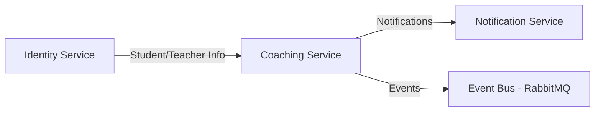

# Coaching Service - Implementation Plan

**Proje:** EduPlatform Öğrenci Koçluk Sistemi  
**Tarih:** 20 Ocak 2026  
**Versiyon:** 1.0 MVP

---

## 📋 PROJE KAPSAMI

### Hedef Kitleönü
- **K-12:** İlkokul, Ortaokul, Lise
- **Sınav Odaklı:** LGS ve YKS hazırlık
- **Sadece Akademik Başarı**

### Temel Özellikler

1. **Ödevlendirme Sistemi**
   - Öğretmen → Öğrenci ödev atama
   - Grup ödev atama
   - Bildirim sistemi (assignment, completion)
   
2. **Sınav Sonuçları Yönetimi**
   - Sınav ekleme
   - Sonuç girişi
   - Detaylı analiz ve raporlama

3. **Grup Koçluğu**
   - 1-1 koçluk
   - Grup seansları
   - Online seans desteği

4. **Bildirim Sistemi**
   - Ödev bildirimleri
   - Toplu bildirim (kurum/öğretmen)
   - Ödev tamamlama bildirimleri

5. **Raporlama**
   - Öğrenci akademik raporu
   - Sınıf/grup raporları
   - Ödev tamamlama istatistikleri
   - Sınav performans analizi

---

## 🏗️ MİMARİ TASARIM

### Domain Entities

```
Coaching Service Domain
├── Assignment (Ödev)
│   ├── Individual Assignment
│   └── Group Assignment
├── Exam (Sınav)
├── ExamResult (Sınav Sonucu)
├── CoachingSession (Koçluk Seansı)
├── SessionAttendance (Seans Katılımı)
├── AcademicGoal (Akademik Hedef)
└── ProgressTracking (İlerleme Takibi)
```

### Servis İlişkileri



---

## 📊 DATABASE SCHEMA

### Assignments (Ödevler)

```sql
CREATE TABLE Assignments (
    Id UUID PRIMARY KEY,
    TeacherId UUID NOT NULL,  -- Identity Service FK
    InstitutionId UUID,        -- Institution FK (optional)
    
    Title VARCHAR(200) NOT NULL,
    Description TEXT,
    Subject VARCHAR(100),      -- Matematik, Türkçe, etc.
    
    AssignmentType VARCHAR(20), -- Individual, Group
    TargetGradeLevel INT,      -- 1-12
    
    DueDate TIMESTAMP NOT NULL,
    EstimatedDurationMinutes INT,
    
    MaxScore DECIMAL(5,2),
    PassingScore DECIMAL(5,2),
    
    Status VARCHAR(20),        -- Active, Completed, Cancelled
    CreatedAt TIMESTAMP DEFAULT NOW(),
    UpdatedAt TIMESTAMP
);

CREATE TABLE AssignmentStudents (
    Id UUID PRIMARY KEY,
    AssignmentId UUID REFERENCES Assignments(Id),
    StudentId UUID NOT NULL,   -- Identity Service FK
    
    SubmittedAt TIMESTAMP,
    Score DECIMAL(5,2),
    TeacherFeedback TEXT,
    Status VARCHAR(20),        -- Assigned, InProgress, Submitted, Graded
    
    CreatedAt TIMESTAMP DEFAULT NOW()
);
```

### Exams (Sınavlar)

```sql
CREATE TABLE Exams (
    Id UUID PRIMARY KEY,
    InstitutionId UUID,
    CreatedByTeacherId UUID NOT NULL,
    
    Title VARCHAR(200) NOT NULL,
    ExamType VARCHAR(50),      -- Mock, Weekly, LGS, YKS
    Subject VARCHAR(100),
    
    ExamDate DATE NOT NULL,
    Duration INT,              -- minutes
    MaxScore DECIMAL(5,2),
    
    TargetGradeLevel INT,
    
    CreatedAt TIMESTAMP DEFAULT NOW(),
    UpdatedAt TIMESTAMP
);

CREATE TABLE ExamResults (
    Id UUID PRIMARY KEY,
    ExamId UUID REFERENCES Exams(Id),
    StudentId UUID NOT NULL,
    
    Score DECIMAL(5,2),
    CorrectAnswers INT,
    WrongAnswers INT,
    EmptyAnswers INT,
    
    SubjectScores JSONB,       -- {"Matematik": 85, "Türkçe": 90}
    Ranking INT,               -- Class ranking
    
    TeacherNotes TEXT,
    
    CreatedAt TIMESTAMP DEFAULT NOW()
);
```

### Coaching Sessions (Koçluk Seansları)

```sql
CREATE TABLE CoachingSessions (
    Id UUID PRIMARY KEY,
    TeacherId UUID NOT NULL,
    InstitutionId UUID,
    
    Title VARCHAR(200),
    Description TEXT,
    SessionType VARCHAR(20),   -- OneOnOne, Group
    
    ScheduledDate TIMESTAMP NOT NULL,
    DurationMinutes INT DEFAULT 60,
    
    MeetingLink VARCHAR(500),  -- Zoom, Teams link
    Status VARCHAR(20),        -- Scheduled, Completed, Cancelled
    
    CreatedAt TIMESTAMP DEFAULT NOW(),
    UpdatedAt TIMESTAMP
);

CREATE TABLE SessionAttendances (
    Id UUID PRIMARY KEY,
    SessionId UUID REFERENCES CoachingSessions(Id),
    StudentId UUID NOT NULL,
    
    AttendanceStatus VARCHAR(20), -- Present, Absent, Late
    JoinedAt TIMESTAMP,
    LeftAt TIMESTAMP,
    
    StudentNote TEXT,
    TeacherNote TEXT,
    
    CreatedAt TIMESTAMP DEFAULT NOW()
);
```

### Goals & Progress (Hedef ve İlerleme)

```sql
CREATE TABLE AcademicGoals (
    Id UUID PRIMARY KEY,
    StudentId UUID NOT NULL,
    SetByTeacherId UUID,
    
    Title VARCHAR(200) NOT NULL,
    Description TEXT,
    Category VARCHAR(50),      -- ExamPreparation, SubjectMastery,  
    TargetExamType VARCHAR(50), -- LGS, YKS
    
    TargetScore DECIMAL(5,2),
    TargetDate DATE,
    
    CurrentProgress INT,       -- 0-100%
    IsCompleted BOOLEAN DEFAULT FALSE,
    
    CreatedAt TIMESTAMP DEFAULT NOW(),
    UpdatedAt TIMESTAMP
);
```

---

## 🎯 API ENDPOINTS

### Assignments API

```
POST    /api/assignments                    # Ödev oluştur
GET     /api/assignments                    # Ödev listesi (filtreli)
GET     /api/assignments/{id}               # Ödev detayı
PUT     /api/assignments/{id}               # Ödev güncelle
DELETE  /api/assignments/{id}               # Ödev sil

POST    /api/assignments/{id}/assign-students    # Öğrencilere ata
POST    /api/assignments/{id}/submit             # Öğrenci ödev teslim
PUT     /api/assignments/{id}/grade              # Ödev notlandır

# Bulk operations
POST    /api/assignments/bulk-create        # Toplu ödev oluştur
POST    /api/assignments/bulk-notify        # Toplu bildirim gönder
```

### Exams API

```
POST    /api/exams                          # Sınav oluştur
GET     /api/exams                          # Sınav listesi
GET     /api/exams/{id}                     # Sınav detayı
PUT     /api/exams/{id}                     # Sınav güncelle

POST    /api/exams/{id}/results             # Sonuç ekle (toplu)
GET     /api/exams/{id}/results             # Sınav sonuçları
GET     /api/exams/{id}/statistics          # Sınav istatistikleri
```

### Sessions API

```
POST    /api/sessions                       # Seans planla
GET     /api/sessions/upcoming              # Yaklaşan seanslar
GET     /api/sessions/{id}                  # Seans detayı
PUT     /api/sessions/{id}                  # Seans güncelle
DELETE  /api/sessions/{id}                  # Seans iptal

POST    /api/sessions/{id}/attendance       # Katılım kaydet
GET     /api/sessions/{id}/attendances      # Katılım listesi
```

### Goals API

```
POST    /api/goals                          # Hedef oluştur
GET     /api/goals/student/{studentId}      # Öğrenci hedefleri
PUT     /api/goals/{id}                     # Hedef güncelle
PUT     /api/goals/{id}/progress            # İlerleme güncelle
```

### Reports API

```
GET     /api/reports/student/{id}/academic          # Akademik rapor
GET     /api/reports/student/{id}/assignments       # Ödev raporu
GET     /api/reports/student/{id}/exams             # Sınav raporu
GET     /api/reports/class/{gradeLevel}/summary     # Sınıf özet raporu
GET     /api/reports/teacher/{teacherId}/overview   # Öğretmen genel rapor
```

---

## 📡 EVENT-DRIVEN ARCHITECTURE

### Events to Publish

```yaml
AssignmentCreatedEvent:
  - AssignmentId
  - TeacherId
  - StudentIds[]
  - DueDate
  - Title

AssignmentSubmittedEvent:
  - AssignmentId
  - StudentId
  - SubmittedAt

AssignmentGradedEvent:
  - AssignmentId
  - StudentId
  - Score
  - TeacherFeedback

ExamResultAddedEvent:
  - ExamId
  - StudentId
  - Score
  - Ranking

SessionScheduledEvent:
  - SessionId
  - TeacherId
  - StudentIds[]
  - ScheduledDate

GoalCompletedEvent:
  - GoalId
  - StudentId
  - CompletedAt
```

### Events to Consume

```yaml
From Identity Service:
  - StudentCreatedEvent
  - TeacherCreatedEvent
  - TeacherStudentAssignedEvent
```

---

## 🔔 NOTIFICATION INTEGRATION

### Notification Scenarios

1. **Ödev Bildirimleri**
   ```json
   {
     "type": "AssignmentCreated",
     "recipientIds": ["student-uuid-1", "student-uuid-2"],
     "title": "Yeni Ödev: Matematik - Fonksiyonlar",
     "message": "Son teslim: 25 Ocak 2026",
     "priority": "Normal",
     "metadata": {
       "assignmentId": "uuid",
       "dueDate": "2026-01-25"
     }
   }
   ```

2. **Ödev Tamamlama (Öğretmene)**
   ```json
   {
     "type": "AssignmentSubmitted",
     "recipientId": "teacher-uuid",
     "title": "Ahmet Yılmaz ödevi teslim etti",
     "message": "Matematik - Fonksiyonlar",
     "priority": "Normal"
   }
   ```

3. **Toplu Bildirim**
   ```json
   {
     "type": "BulkAnnouncement",
     "recipientIds": [...],  // Tüm öğrenciler veya belirli grup
     "title": "Duyuru: Deneme Sınavı",
     "message": "25 Ocak Cumartesi günü deneme sınavımız...",
     "priority": "High"
   }
   ```

---

## 🚀 IMPLEMENTATION ROADMAP

### Phase 1: Temel Altyapı (1 Hafta)

**Gün 1-2: Project Setup**
- [x] Coaching Service projesi skelet yapısı
- [ ] Shared Kernel referansları
- [ ] Dependency Injection setup
- [ ] Database migration altyapısı

**Gün 3-5: Domain Layer**
- [ ] Entity'ler (Assignment, Exam, Session, Goal)
- [ ] Value Objects
- [ ] Domain Events
- [ ] Repository Interfaces

**Gün 6-7: Infrastructure Layer**
- [ ] DbContext yapılandırması
- [ ] Repository implementations
- [ ] Migration'lar
- [ ] Event Publishers

### Phase 2: Core Features (2 Hafta)

**Hafta 2: Ödevlendirme Sistemi**
- [ ] Assignment CRUD operations
- [ ] Student assignment logic
- [ ] Submission handling
- [ ] Grading system
- [ ] Notification integration

**Hafta 3: Sınav ve Raporlama**
- [ ] Exam management
- [ ] Result input system
- [ ] Statistics calculator
- [ ] Report generator
- [ ] Export to PDF

### Phase 3: Advanced Features (1 Hafta)

**Hafta 4:**
- [ ] Coaching sessions
- [ ] Goals tracking
- [ ] Bulk operations
- [ ] Analytics dashboard data
- [ ] Performance optimizations

---

## ✅ DEFINITION OF DONE

### MVP Acceptance Criteria

- [ ] Öğretmen ödev oluşturabilir
- [ ] Öğrencilere toplu ödev atanabilir
- [ ] Ödev teslimi yapılabilir
- [ ] Ödevler notlandırılabilir
- [ ] Sınav sonuçları eklenebilir
- [ ] Öğrenci akademik raporu oluşturulabilir
- [ ] Bildirimler gönderilir (ödev atama, teslim)
- [ ] Toplu bildirim gönderilebilir
- [ ] Tüm CRUD operasyonlar test edilmiş
- [ ] API documentation (Swagger)
- [ ] Database migrations çalışır
- [ ] Docker support

---

## 🔒 SECURITY & AUTHORIZATION

### Role-Based Access Control

```yaml
Teacher:
  - Create/Update/Delete assignments
  - Grade assignments
  - Add exam results
  - Create coaching sessions
  - Send bulk notifications
  - View all assigned students  - View reports

Student:
  - View assigned assignments
  - Submit assignments
  - View own exam results
  - View own goals and progress
  - Join coaching sessions

Parent:
  - View child's assignments
  - View child's exam results
  - View child reports

InstitutionAdmin:
  - View all teachers/students in institution
  - Send institution-wide notifications
  - View institution reports
```

---

## 📈 SUCCESS METRICS

### KPIs to Track

```yaml
Assignment Completion:
  - On-time submission rate
  - Average score
  - Completion rate per subject

Exam Performance:
  - Average score trends
  - Score distribution
  - Improvement rate over time

Engagement:
  - Session attendance rate
  - Assignment submission rate
  - Active students count

Teacher Activity:
  - Assignments created per week
  - Grading turnaround time
  - Session frequency
```

---

## 🛠️ TECHNICAL STACK

```yaml
Backend:
  - .NET 9.0
  - ASP.NET Core Web API
  - EF Core 9.0 + PostgreSQL
  - MassTransit + RabbitMQ
  - FluentValidation

Authentication:
  - Keycloak JWT

Patterns:
  - CQRS (MediatR)
  - Repository Pattern
  - Domain-Driven Design
  - Event Sourcing (for audit)

Testing:
  - xUnit
  - FluentAssertions
  - Moq
```

---

## 📦 DELIVERABLES

### MVP Deliverables

1. **Source Code**
   - Coaching.Domain
   - Coaching.Application
   - Coaching.Infrastructure
   - Coaching.API

2. **Database**
   - Schema migrations
   - Seed data scripts

3. **Documentation**
   - API documentation (Swagger)
   - Setup guide
   - Architecture decision records

4. **Deployment**
   - Docker Compose configuration
   - Environment configuration guide

---

**İmplementasyon Başlıyor!** 🚀
